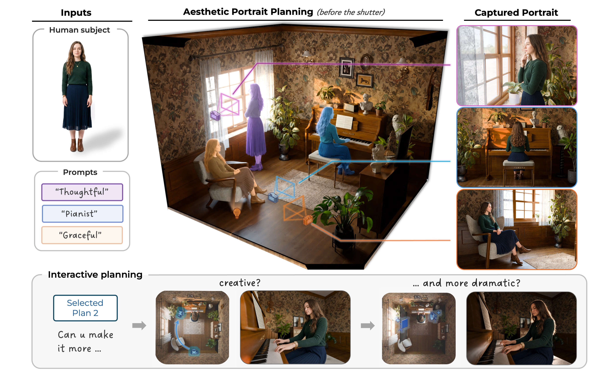

## Before the Shutter: Aesthetic and Actionable Portrait Photography Planning in 3D Scenes
---

TL;DR: Taking a beautiful portrait photo is challenging. We propose a system that helps you to plan for the human pose, camera setting, and light devices, so that you just need to follow it and press the shutter.

---
## Overview

Examples of staging (i.e., human pose planning) and final captured photo after camera and lighting planning.
